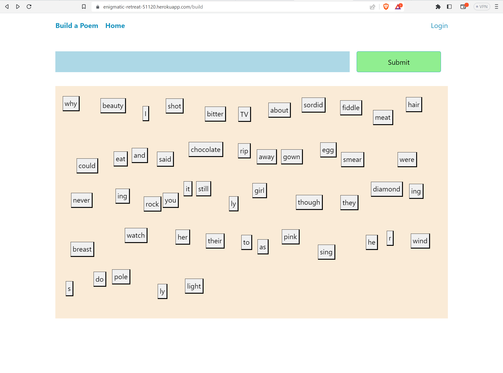

# build-a-poem
Release your inner fridge-magnet-esque poet.

---

## Description

A webapp that allows you to play with fridge-magnet-esque word tiles to form small poems. 

Technologies: Node.js, Express.js, Handlebars.js, MySQL, Sequelize, Bcrypt, Pico CSS, and Animate CSS.

## Link to the Live Webpage

https://enigmatic-retreat-51120.herokuapp.com/

## Installation

N/A

## Authors

Isaac Perk
Joseph Gerona
Thomas James

## License

Please refer to the LICENSE listed in the repository.